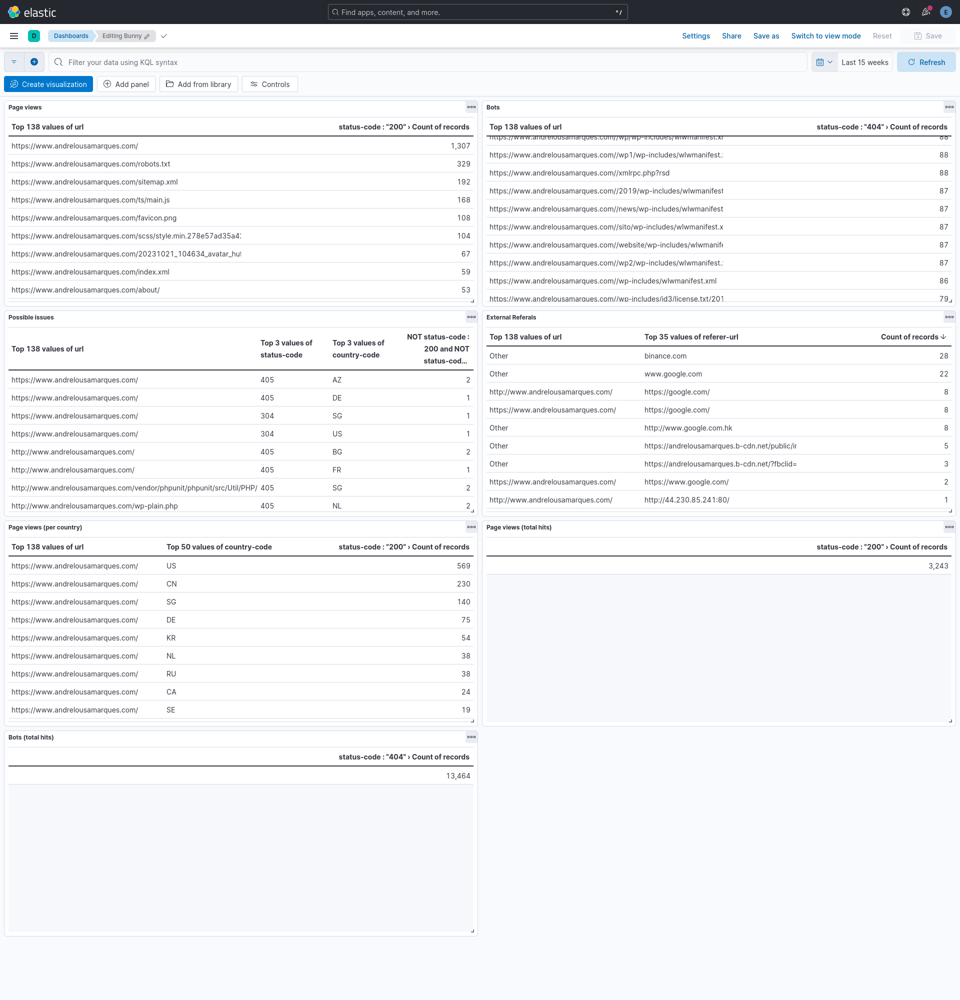

# Bunny Log metrics

This repository provides a dockerized ELK stack to analyze server logs from bunny.net CDN.

1. Download the server logs from bunny and extract them to a `/tmp/logs` folder (logs can be organized in sub-folders inside this folder)
2. Run `bash log_stats.sh`: It will launch elasticsearch, then parse the logs into elasticsearch using logstash and finally launch kibana with a default set of dashboards tailored to bunny

```
bash log_stats.sh
[+] Running 3/3
✔ Network bunny-log-metrics_logs    Created
✔ Container elasticsearch           Healthy
✔ Container wait_for_elasticsearch  Started
wait_for_elasticsearch exited with code 0
AAEAAWVsYXN0aWMva2liYW5hL2tpYmFuYS10b2tlbjpxMkJmbEVpQ1J4S1hvY1pKVTI0Z0VR
[+] Running 2/2
✔ Container elasticsearch  Healthy                                     
✔ Container logstash       Started                                    
Waiting for logstash to process input data...
DONE
[+] Running 2/1
✔ Container logstash              Removed                            
! Network bunny-log-metrics_logs  Resource is still in use           
[+] Running 3/3
✔ Container elasticsearch    Healthy                                 
✔ Container kibana           Healthy                                 
✔ Container wait_for_kibana  Started                                 
wait_for_kibana exited with code 0
{"successCount":8,"success":true,"warnings":[],"successResults":[{"type":"config-global","id":"6f2d94a5-814c-49de-8f46-313eb9958444","meta":{"title":"Global Settings [6f2d94a5-814c-49de-8f46-313eb9958444]"},"managed":false,"destinationId":"07255510-3be4-4857-8dd9-64ed2126428f"},{"type":"config","id":"8.16.1","meta":{"title":"Advanced Settings [8.16.1]"},"managed":false,"destinationId":"13d698d8-892a-4c64-b1d0-5907d974d0fa"},{"type":"config-global","id":"8.16.1","meta":{"title":"Global Settings [8.16.1]"},"managed":false,"destinationId":"f5190f58-889d-4282-aa31-23bfd70e3146"},{"type":"config","id":"8d82f8f8-4637-4525-9a7c-0dad83d4b1c8","meta":{"title":"Advanced Settings [8d82f8f8-4637-4525-9a7c-0dad83d4b1c8]"},"managed":false,"destinationId":"d192930d-a575-4df0-ad05-281d4562ac32"},{"type":"config","id":"8ea99fe4-3e2a-401b-bf3b-e37df6bbc771","meta":{"title":"Advanced Settings [8ea99fe4-3e2a-401b-bf3b-e37df6bbc771]"},"managed":false,"destinationId":"3016b708-7aba-4f57-a5b1-c04254eb064b"},{"type":"index-pattern","id":"ca04b99d-32b1-4c10-a778-8b8a25ea2e4e","meta":{"title":"bunny","icon":"indexPatternApp"},"managed":false,"destinationId":"f4f5df40-52e6-4c1f-a029-a1a3faa242e9"},{"type":"dashboard","id":"a560f8e8-64bd-44c4-a096-92d65e510147","meta":{"title":"Bunny","icon":"dashboardApp"},"managed":false,"destinationId":"4ba5d142-d1ee-4465-94f4-19a8c782abb8"},{"type":"config-global","id":"c667d096-3e71-489f-9896-d50caa0fb915","meta":{"title":"Global Settings [c667d096-3e71-489f-9896-d50caa0fb915]"},"managed":false,"destinationId":"c4e026a2-6f33-4589-9645-f9cf2b0269c3"}]}%
Kibana is READY! You can access it at http://localhost:5601
```

Once you have an output as above you can access kibana at `localhost:5601` (user "elastic"; password "elastic") and can analyze the logs using the provided dashboards below (Hamburguer menu -> Dashboards -> Bunny), adjusting the time range and filters as needed. You can also create your own dashboards as needed.



To persist your kibana dashboard and setting changes you can export them at http://localhost:5601/app/management/kibana/objects (you can access this page also via `Hamburguer menu -> Management -> Stack Management -> Saved Objects`) by clicking on `Export XX Objects` and replacing this repo `bunny.ndjson` file

## Troubleshooting

If logstash takes too long to terminate ensure that the folder `/tmp/logs` exists and has actual log data. The script will not progress until at least one line of data has been processed

If kibana (localhost:5601) shows a blank page at any time check the browser console logs and temporarily disable all browser extensions (had an issue with a local custom browser extension that was causing issues and was not visible in the browser console logs and was hard to debug)
